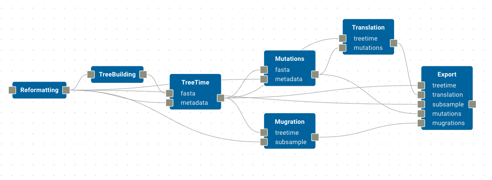
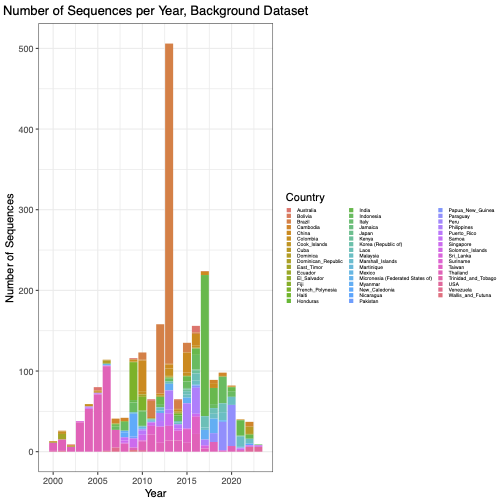

# Build out the workflow

Though complex, the [Dengue repository](https://github.com/rhysinward/dengue_pipeline) contains many curated modules that simplify this process, and provide good defaults for many of the steps in the pipeline. Rather than go through each step in detail, we will provide an overview of the workflow and introduce new concepts as necessary.

## Steps

We will approach the workflow by considering the following steps:

- [Sequence alignment](sequence-alignment)
- [Split genome](split-genome)
- [Subsample DENV](subsample-denv)
- [Tree building](tree-building)
- [Mutation, mugration and translation](mutations-mugrations-translation)
- [Extract and plot](extract-and-plot)

Finally we will [run the workflow](run-workflow) and (briefly) examine some results.

(sequence-alignment)=
## Sequence alignment

From your `AcquireData` module drag and connect the `ProcessGenbankData`, `ProcessDengueData` and `SequenceAlignment` modules in order. All of these modules provide a single input and single output each, so there should be no ambiguity in the connections. You should take a moment to read the descriptions provided for each module, which are available by clicking on them. Some modules, like the `AcquireData` module, provide editable parameters, while others like the `SequenceAlignment` module do not.

(split-genome)=
## Split genome

With sequence alignment complete we now want to segregate the E gene and whole genomes and performing quality control. We do this with the `SplitGenomaAndQC` module, which contains parameters `WG Threshold` and `EG Threshold` for the minimum length of the whole genome and E gene respectively. Serotype labels are listed, which default to `Dengue_1`, `Dengue_2`, `Dengue_3`, and `Dengue_4`. These labels are used to identify the serotype of the sequences in the dataset. This produces `EG` and `WG` `fasta` files for each serotype, which are used in the next step.

(subsample-denv)=
## Subsample DENV

The `SubsampleDENV` module takes the `EG` and `WG` `fasta` files and subsamples them to a specified number of sequences. The `SubsampleDENV` module contains parameters for the number of sequences to subsample. The `SubsampleDENV` module produces `fasta` files for each serotype, along with supporting files which are used in the next step.

(tree-building)=
## Tree building

Following the subsample step we then proceed with tree-building; however, this first requires cleaning the data output from `SubsampleDENV`. For this we use a custom `Reformatting` module, which is a simple R script that removes any sequences with ambiguous nucleotides. The `Reformatting` module produces `fasta` files for each serotype, which feed into several downstream modules. Next, add a `TreeBuilding` module which receives input from the `Reformatting` module.

Now, we want to infer the time-calibrated trees for each Dengue virus serotype using the `TreeTime` module, which wraps the [TreeTime](https://github.com/neherlab/treetime) software package. TreeTime requires `fasta` and `metadata` files. The `fasta` port should receive input from the `TreeBuilding` module, while the `metadata` port receives input from the `Reformatting` module.

(mutations-mugrations-translation)=
## Mutation, mugration and translation

We now want to perform mutation, mugration and translation. This is handled with dedicated modules for each, being careful to ensure that their input and output ports connect to the correct data locations.

- The `Mutations` module received `fasta` input from `TreeTime` and `metadata` input from the `Reformatting` module.
- The `Mugrations` modules receives the same inputs, but it's ports are labelled differently. Mugrations receives `treetime` from the `TreeTime` module and `subsample` from the `Reformatting` module.
- Finally, `Translation` receives `treetime` inputs from `TreeTime` and `mutations` inputs from `Mutations`.

We can actually combine the outputs from these modules into a single `Export` module, which will collate all of the results into a single output directory. Let's do this now, mapping the `Export` module's `treetime`, `translation`, `mutations`, and `mugrations` inputs to their corresponding modules, and the `subsample` input to the `Reformatting` module.

This section of the workflow should look like this:

(extract-and-plot)=
## Extract and plot

The final step in the workflow is to extract and plot the results. We begin by connecting `Export` to a new `ExtractPhyloTree` module, then connect `TreeBreakdown` and `PlotExportsAndImports` in sequence.

The complete workflow should look very similar to this:

(run-workflow)=
# Run the workflow

Click `Build & Run` then `Test Build`. If you have not click `Delete Test Build` then the existing data (and conda environment) from `AcquireData` will still be present and this step will not need to be re-run. However, all other modules will need to download their environments and startup. This can take some time, so please be patient. Once the build is complete the workflow will launch (you should see progress in the `Logs` tab; if you encounter any errors, please refer to the `Logs` tab for more information). When completed, click the `Open Results` button to be taken to the test build folder where you will find a `results` directory containing the output of the workflow.

The workflow, when fully run, will produce numerous outputs including `fasta`, `csv` and `pdf` files. For example,we can view the number of sequences per year in the background dataset, shown per country for the DENV4 serotype by opening the file `results/subsample_denv/background_metadata_plot_even_denv4.pdf`:

